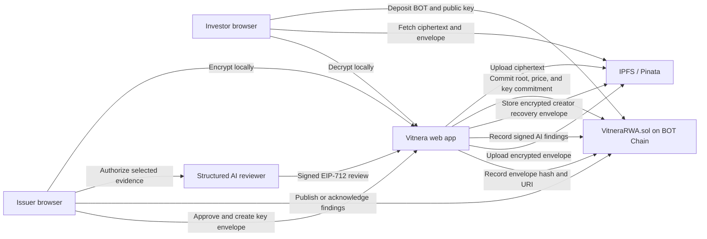

# Vitnera

Private due-diligence rooms for real-world assets on BOT Chain.

Vitnera lets an issuer encrypt evidence in the browser, obtain a structured AI review, and publish a paid data room. Investors deposit BOT into contract escrow, request access with a wallet-bound encryption key, and decrypt approved evidence locally.

The first product template is intentionally broad and small: `rwa-basic-v1` supports equipment, real estate, commodities, receivables, and other assets through three required evidence roles:

1. Asset overview
2. Ownership or control evidence
3. Valuation or financial evidence

## Live Contract

| Item | BOT Chain testnet value |
| --- | --- |
| Chain ID | `968` |
| Contract | [`0xc6a92F7E7BdDB2ca149518aE408006031808F117`](https://scan.botchain.ai/address/0xc6a92F7E7BdDB2ca149518aE408006031808F117) |
| Deployment block | `20642802` |
| Deployment transaction | [`0xb9a93caf…ede5760`](https://scan.botchain.ai/tx/0xb9a93caf4151f4cea3624754ba62fec666b1ab5613567c05f2ff31d78ede5760) |
| EIP-712 domain | `Vitnera RWA`, version `1` |
| Supported template | `rwa-basic-v1` |

## Product Flow

### Issuer

1. Add a room title, access price, and one or more evidence files. Asset type and broad location are optional.
2. Generate a public summary locally from public labels and evidence-category counts. No document text or filenames leave the browser for this summary.
3. Set up one passphrase-encrypted creator recovery identity and store its downloaded recovery kit safely.
4. Vitnera generates a fresh AES-256-GCM room key for the room version, encrypts files locally, and uploads only ciphertext to IPFS.
5. The room key is sealed to the creator recovery public key. The encrypted creator envelope is included in integrity-anchored metadata, while the contract records its metadata hash and room-key commitment.
6. With explicit consent, selected plaintext is sent to the configured AI reviewer for a separate structured due-diligence session.
7. The signed EIP-712 review is recorded on-chain, then the issuer makes a separate publication decision. Non-ready findings require an on-chain acknowledgement.
8. The issuer approves or rejects investor requests and withdraws settled BOT earnings.

### Investor

1. Inspect public asset information and review evidence.
2. Generate an X25519 key pair locally and deposit the exact room price into contract escrow.
3. The issuer encrypts the room key for that investor public key.
4. The investor verifies the envelope hash, downloads ciphertext, and decrypts the approved document version locally.
5. Rejected or expired requests become pull-based refunds.

## Architecture



## What Is Enforced On-Chain

[`contracts/src/VitneraRWA.sol`](./contracts/src/VitneraRWA.sol) enforces:

- exact payment from `room.accessPrice`;
- supported templates and review policy versions;
- EIP-712 reviewer/verifier signatures, authorization, nonces, and expiries;
- review binding to the current room version, template, and document root;
- separate signed-review recording and issuer-controlled publication;
- on-chain issuer acknowledgement when publishing with non-ready AI findings;
- BOT escrow, issuer earnings, investor refunds, and pull-based withdrawals;
- new key commitments for every document-root update;
- request approval, rejection, expiry refund, revocation, pause, and archive state.

AI does not have final publication authority. A ready review can be published by the issuer normally. A non-ready review can be published only through `activateDataRoomWithAcknowledgement`, which records an issuer acknowledgement hash and exposes that override to investors. A new document version or review invalidates the previous acknowledgement.

## AI Review

The reviewer in [`services/reviewer`](./services/reviewer) is a structured evidence-analysis service, not a chatbot or autonomous gatekeeper. It produces a concise executive summary and key findings, extracts asset facts, and evaluates identifiers, parties, dates, amounts, ownership/control claims, valuation evidence, document completeness, and inconsistencies. The issuer can download the complete signed review result from the Workspace and remains responsible for the publication decision.

Public labels simplify the Solidity enum names:

| Contract status | Product label |
| --- | --- |
| `ReviewReady` | Ready |
| `NeedsReview` | Attention needed |
| `Incomplete` | Incomplete |

Public marketplace summaries are generated locally from fields already intended for publication and generic evidence-category counts. The summary flow does not call an AI provider and never sends file content or filenames over the network.

The separate AI evidence review has a narrower, explicit trust boundary: storage and on-chain data contain ciphertext or commitments, but documents selected by the issuer for review are decrypted locally and transmitted only when the issuer starts an authorized review session. Provider retention and abuse-monitoring policies may apply. An AI review is not legal verification, regulatory approval, or investment advice.

## Creator Recovery

- A creator generates one X25519 recovery identity per wallet instead of setting a new passphrase for every room.
- The private recovery identity is encrypted locally with PBKDF2-SHA-256 and AES-256-GCM, then downloaded as `vitnera-*-creator-recovery.json`.
- The plaintext recovery identity is kept in `sessionStorage` only. It is not written to `localStorage`, IPFS, BOT Chain, or either backend service.
- Every room version receives a new random AES-256-GCM key. That key is sealed to the creator recovery public key with X25519, HKDF-SHA-256, and AES-256-GCM.
- The encrypted creator envelope is part of hashed public metadata. Recovery succeeds only when the recovered room key matches the on-chain key commitment.
- Existing `v1/v2` rooms remain readable through their legacy per-room backup controls.

## Repository

```text
vitnera/
├── apps/web/              React, Vite, wagmi, and browser cryptography UI
├── contracts/             Foundry contract, deployment script, and tests
├── packages/core/         Schemas, encryption, hashing, manifests, and envelopes
├── services/reviewer/     Structured AI review and EIP-712 signer
├── docs/DEPLOYMENT.md
├── .env.example
└── package.json
```

## Local Development

Requirements:

- Node.js 20+
- npm 10+
- Foundry
- A BOT Chain-compatible browser wallet
- An upload API that accepts encrypted blobs
- A Groq/OpenAI-compatible API key
- A dedicated reviewer signing key

```bash
cd /Users/apple/Documents/vitnera
npm install
npm run setup:contracts
npm test
npm run build
```

Run the local services:

```bash
# Terminal 1
npm run dev:reviewer

# Terminal 2
npm run dev
```

The web app defaults to `http://localhost:5174`.

## Environment

Copy [`.env.example`](./.env.example) to `.env`. Never expose non-`VITE_` values to the browser.

Server/deployment variables:

```env
BOTCHAIN_RPC_URL=https://rpc.bohr.life
BOTCHAIN_CHAIN_ID=968
VITNERA_CONTRACT=0xc6a92F7E7BdDB2ca149518aE408006031808F117
DEPLOYER_PRIVATE_KEY=
REVIEWER_ADDRESS=
VERIFIER_ADDRESS=

AI_PROVIDER=groq
AI_API_KEY=
AI_BASE_URL=https://api.groq.com/openai/v1
AI_MODEL=openai/gpt-oss-20b
REVIEWER_PRIVATE_KEY=
REVIEWER_ALLOWED_ORIGINS=http://localhost:5174
```

Public frontend variables:

```env
VITE_BOTCHAIN_RPC_URL=https://rpc.bohr.life
VITE_BOTCHAIN_CHAIN_ID=968
VITE_VITNERA_CONTRACT=0xc6a92F7E7BdDB2ca149518aE408006031808F117
VITE_DEPLOYMENT_BLOCK=20642802
VITE_STORAGE_API_URL=https://your-upload-api.example
VITE_REVIEWER_API_URL=https://your-reviewer.example
```

## Verification

Current automated checks:

- 17 Foundry contract tests, including issuer acknowledgement overrides, a complete issuer-to-investor lifecycle, exact-payment fuzzing, replay protection, version/key rotation, and escrow accounting;
- 8 core cryptography, recovery, summary, and manifest tests;
- 7 reviewer policy, schema, and signing tests;
- TypeScript compilation and production Vite build.

Run everything with:

```bash
npm test
npm run build
```

## Security Boundaries

- IPFS confidentiality comes from encryption, not CID secrecy.
- Raw room and investor private keys are not stored in `localStorage`.
- Active keys and the creator recovery identity are session-scoped; durable recovery exports are passphrase-encrypted.
- New room versions rotate their AES key and seal it to the creator recovery identity through an integrity-anchored envelope.
- Public summaries are generated locally and disclose no document content to an AI provider.
- Updating documents rotates the room key and invalidates the prior review.
- Revocation blocks future application access and future versions; it cannot erase plaintext already decrypted by an investor.
- The authorized AI reviewer is an explicit trust boundary for analysis and signing. The contract verifies its signature but does not independently reproduce the AI analysis.
- AI findings are advisory. The issuer owns the publication decision, and non-ready overrides are acknowledged on-chain and disclosed to investors.

See [`docs/DEPLOYMENT.md`](./docs/DEPLOYMENT.md) for deployment and secret separation.

## License

[MIT](./LICENSE)
