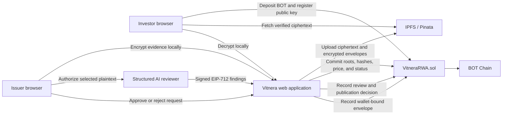

# Vitnera

**Confidential due-diligence infrastructure for real-world assets.**

Vitnera gives issuers a controlled way to publish encrypted asset evidence, obtain structured AI findings, and grant paid, wallet-bound access to investors. Documents are encrypted in the browser, ciphertext is stored on IPFS, commercial settlement runs on BOT Chain, and approved investors decrypt files locally.

The product is designed for asset owners, fund operators, brokers, lenders, and professional investors who need verifiable diligence workflows without turning sensitive documents into public blockchain data.

> **Current release:** BOT Chain testnet beta. The complete issuer-to-investor workflow is implemented and tested. The contract has not completed an independent production security audit.

## Product

Traditional data rooms rely on a central operator to control files, approve access, reconcile payments, and preserve an audit trail. Vitnera separates those responsibilities across browser cryptography, content-addressed storage, signed AI attestations, and an on-chain escrow protocol.

| Capability | Product behavior |
| --- | --- |
| Private evidence rooms | Files are encrypted locally with a new AES-256-GCM key for every room version. |
| Structured AI review | Issuers explicitly authorize selected evidence for review and receive signed, root-bound findings. |
| Issuer-controlled publishing | AI findings inform publication but do not replace the issuer's decision. Non-ready overrides are acknowledged on-chain. |
| Paid investor access | Investors deposit the exact room price into BOT Chain escrow before approval. |
| Wallet-bound delivery | Approved room keys are sealed to an investor's X25519 public key. |
| Local decryption | Approved investors verify hashes and decrypt ciphertext in their browser. |
| Versioned evidence | Document changes rotate the room key and invalidate stale reviews and acknowledgements. |
| Verifiable operations | Room, review, access, refund, withdrawal, pause, and archive events are available through the public evidence ledger. |

## Product Surfaces

- **Explore** presents public room information, price, review state, and issuer disclosures without exposing protected evidence.
- **Issuer Workspace** creates rooms, encrypts and uploads evidence, runs reviews, publishes room versions, handles requests, and withdraws earnings.
- **Room Details** explains the current evidence version, review outcome, commercial terms, and access state.
- **My Access** manages investor requests, refunds, encrypted key envelopes, and local document decryption.
- **Technical Proof** reads protocol events directly from BOT Chain and links each operation to the explorer.

## Lifecycle

### 1. Create and seal a room

The issuer defines the room's public title, access price, and evidence roles. Vitnera generates a fresh room key, encrypts every file locally, and uploads only ciphertext. The public metadata hash, encrypted document root, key commitment, terms hash, template, and price are recorded by the contract.

### 2. Review evidence

The issuer chooses which files to disclose to the configured reviewer. Those files are decrypted locally and sent through an explicit review request. The reviewer returns structured findings and an EIP-712 signature bound to:

- room ID and version;
- document root and template;
- review status;
- risk flags and report hashes;
- policy version, nonce, and expiry.

The contract verifies the authorized reviewer, signature, nonce, version, root, policy, and expiry before recording the review.

### 3. Publish with issuer accountability

A `ReviewReady` room can be activated normally. `NeedsReview` and `Incomplete` rooms require the issuer to submit an acknowledgement hash before publication. This keeps AI advisory while making the issuer's override visible and auditable.

### 4. Request access and settle payment

An investor generates an X25519 key pair locally and requests access with the public key. The contract accepts only the room's exact access price and holds the BOT deposit in escrow.

### 5. Approve and decrypt

The issuer approves the request and seals the current room key to the investor public key. The encrypted envelope is uploaded, and its URI and hash are committed on-chain. The investor verifies the envelope and ciphertext hashes before decrypting the approved room version locally.

### 6. Refund or withdraw

Approved deposits become claimable issuer earnings. Rejected or expired requests become claimable investor refunds. Both use pull-based withdrawals rather than unsolicited transfers.

## Architecture



### System components

| Component | Responsibility | Sensitive material |
| --- | --- | --- |
| `apps/web` | Product UI, wallet operations, browser encryption, local decryption | Session-scoped room and investor keys |
| `contracts` | Room state, review verification, escrow, access state, refunds, earnings, and protocol events | No plaintext documents or private keys |
| `packages/core` | Canonical encoding, schemas, hashing, manifests, summaries, key envelopes, and recovery cryptography | Operates on keys only in the caller's runtime |
| `services/reviewer` | Structured AI analysis and EIP-712 attestation signing | Selected plaintext during an authorized review |
| Upload API | Pinata/IPFS upload boundary for encrypted blobs | Ciphertext only |

## Protocol Guarantees

[`VitneraRWA.sol`](./contracts/src/VitneraRWA.sol) enforces:

- issuer ownership of room mutations;
- supported room templates and review policy versions;
- document-root and room-version binding for every review;
- authorized EIP-712 reviewer and verifier signatures;
- replay protection through signer nonces;
- review and attestation expiry;
- exact access payment from contract state, never a client-selected amount;
- escrow accounting, pull-based earnings, and pull-based refunds;
- fresh key commitments for every document update;
- explicit approval, rejection, expiry, revocation, pause, and archive transitions;
- reentrancy protection and two-step protocol ownership transfer.

AI cannot publish a room, move escrowed funds, issue a key envelope, or approve investor access. Those remain issuer or contract responsibilities.

## Privacy Model

### Public on BOT Chain

- issuer and room identifiers;
- metadata URI and hash;
- document root and room-key commitment;
- template, terms hash, access price, and room status;
- review status, signer, hashes, policy version, and expiry;
- investor encryption public key, payment amount, request state, and encrypted-envelope reference;
- protocol events and accounting totals.

### Encrypted in storage

- evidence files;
- creator recovery envelopes;
- investor key envelopes;
- integrity-addressed room manifests.

### Plaintext processing boundaries

- Evidence is plaintext in the issuer or approved investor browser during local use.
- Files selected for AI review are intentionally disclosed to the reviewer and configured AI provider for that request.
- Review request bodies are excluded from reviewer logs, but provider retention and abuse-monitoring policies may still apply.

IPFS confidentiality comes from encryption, not CID secrecy. An AI review is not legal verification, regulatory approval, investment advice, or a guarantee that source documents are authentic.

## Key Management and Recovery

- Each room version receives a random AES-256-GCM key.
- Creator and investor envelopes use X25519, HKDF-SHA-256, and AES-256-GCM.
- The creator recovery identity is encrypted locally with PBKDF2-SHA-256 and AES-256-GCM.
- Plaintext recovery identities and active room keys are session-scoped and are not written to `localStorage`.
- Recovery kits are downloaded as encrypted JSON and must be stored separately from their passphrases.
- Recovery verifies the reconstructed room key against the on-chain key commitment.
- Updating evidence rotates the room key. Previously approved investors cannot use an old key to decrypt a new room version.

Revocation prevents future application access and future-version delivery. It cannot make an investor forget evidence that was already decrypted. Vitnera does not claim cryptographic erasure of previously disclosed plaintext.

## BOT Chain Testnet

| Item | Value |
| --- | --- |
| Chain ID | `968` |
| RPC | `https://rpc.bohr.life` |
| Contract | [`0xc6a92F7E7BdDB2ca149518aE408006031808F117`](https://scan.botchain.ai/address/0xc6a92F7E7BdDB2ca149518aE408006031808F117) |
| Deployment block | `20642802` |
| Deployment transaction | [`0xeac28b06...9505e41`](https://scan.botchain.ai/tx/0xeac28b06ce0013741df52513e385bc7b9e408ac13233b2eb44de633ff9505e41) |
| EIP-712 domain | `Vitnera RWA`, version `1` |
| Supported template | `rwa-basic-v1` |
| Review policy | Version `1` |

The initial `rwa-basic-v1` template supports equipment, real estate, commodities, receivables, and other assets. It expects three evidence roles: asset overview, ownership or control evidence, and valuation or financial evidence.

## Repository

```text
vitnera/
|-- apps/web/             React, Vite, wagmi, and browser cryptography
|-- contracts/            Foundry contract, deployment script, and tests
|-- packages/core/        Shared schemas, hashing, manifests, and cryptography
|-- services/reviewer/    Structured AI review and EIP-712 signing service
|-- docs/DEPLOYMENT.md    Deployment and operations guide
|-- .env.example          Environment variable reference
`-- package.json          Workspace commands
```

## Local Development

### Requirements

- Node.js 20 or newer
- npm 10 or newer
- Foundry
- A BOT Chain-compatible browser wallet
- A Pinata-compatible encrypted upload API
- A Groq or OpenAI-compatible model endpoint
- A dedicated reviewer signing key

### Install and verify

```bash
git clone https://github.com/Ololadestephen/vitnera.git
cd vitnera
cp .env.example .env
npm install
npm run setup:contracts
npm test
npm run build
```

### Run locally

```bash
# Terminal 1: signed AI reviewer
npm run dev:reviewer

# Terminal 2: web application
npm run dev
```

The web application starts at `http://localhost:5174`. If Vite's dependency optimizer cache becomes stale after dependency changes, run `npm run dev:clean` once.

## Configuration

Only variables prefixed with `VITE_` are exposed to the browser. Private keys and AI credentials must remain in server-only environments.

```env
# Contract deployment and server processes
BOTCHAIN_RPC_URL=https://rpc.bohr.life
BOTCHAIN_CHAIN_ID=968
VITNERA_CONTRACT=0xc6a92F7E7BdDB2ca149518aE408006031808F117
DEPLOYER_PRIVATE_KEY=
REVIEWER_ADDRESS=
VERIFIER_ADDRESS=

# Web application
VITE_BOTCHAIN_RPC_URL=https://rpc.bohr.life
VITE_BOTCHAIN_CHAIN_ID=968
VITE_VITNERA_CONTRACT=0xc6a92F7E7BdDB2ca149518aE408006031808F117
VITE_DEPLOYMENT_BLOCK=20642802
VITE_STORAGE_API_URL=http://localhost:8787
VITE_REVIEWER_API_URL=http://localhost:8790

# Reviewer service
AI_PROVIDER=groq
AI_API_KEY=
AI_BASE_URL=https://api.groq.com/openai/v1
AI_MODEL=openai/gpt-oss-20b
REVIEWER_PRIVATE_KEY=
REVIEWER_PORT=8790
REVIEWER_ALLOWED_ORIGINS=http://localhost:5174
```

The address derived from `REVIEWER_PRIVATE_KEY` must be authorized by the contract and match the expected reviewer identity in the deployed environment. The deployer and reviewer should use separate keys.

## Service Interfaces

### Reviewer

```text
GET  /health       Service readiness
GET  /identity     Reviewer address, chain ID, and contract binding
POST /reviews      Structured review request and signed attestation response
```

### Encrypted upload API

```text
POST /api/upload/ipfs
```

The upload API receives encrypted blobs, display-safe object names, content hashes, and MIME metadata. It never requires room keys or plaintext documents.

## Testing

```bash
npm test
npm run build
npm run lint:contracts
```

The current suite covers:

- 17 Foundry tests for room lifecycle, issuer overrides, exact-payment fuzzing, replay protection, access control, version/key rotation, refunds, and escrow accounting;
- 8 core tests for cryptography, recovery, canonical hashing, summaries, and manifests;
- 7 reviewer tests for schema validation, policy evaluation, and EIP-712 signing;
- TypeScript compilation and a production Vite build.

## Deployment and Operations

Deploy the contract, reviewer, upload API, and web application as separate operational boundaries. The reviewer owns AI and signing secrets; the upload API owns storage credentials; the web application receives only public configuration.

Before a production release:

1. Complete an independent smart-contract and browser-cryptography audit.
2. Use separate deployer, owner, reviewer, verifier, and infrastructure credentials.
3. Restrict reviewer and upload CORS to approved product origins.
4. Use a managed secret store and documented reviewer-key rotation procedure.
5. Use a dedicated, monitored BOT Chain RPC endpoint.
6. Review and contractually define the AI provider's retention policy.
7. Add service monitoring, alerting, backups, rate limiting, and incident response procedures.
8. Run the full test/build gate and verify contract source on the explorer.

See [`docs/DEPLOYMENT.md`](./docs/DEPLOYMENT.md) for deployment commands and environment separation.

## Product Roadmap

- independent protocol and cryptography audit;
- production indexer for faster room and evidence discovery;
- managed issuer organizations and role-based approvals;
- additional versioned asset templates;
- configurable reviewer and independent verifier policies;
- stronger recovery options for institutional custody;
- operational analytics without document-content collection.

## Security

Do not report vulnerabilities through a public issue containing secrets, private documents, or an active exploit. Contact the repository owner privately with the affected component, reproduction steps, and impact. Rotate any credential that may have been exposed before sharing logs.

## License

Vitnera is available under the [MIT License](./LICENSE).
