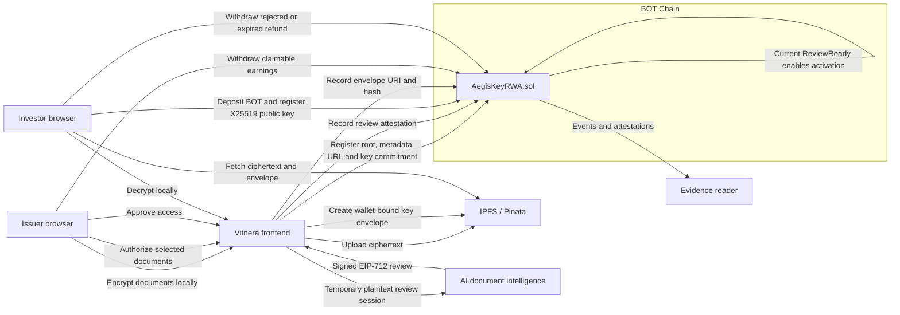

# Vitnera

Confidential due-diligence infrastructure for real-world assets on BOT Chain.

Issuers encrypt solar-asset documents in the browser and upload only ciphertext to IPFS. An explicitly authorized AI review produces a structured, signed EIP-712 attestation. The smart contract accepts the review only when it matches the current document root and version, and only a current `ReviewReady` result can activate the room. Investors then escrow native BOT, register an X25519 public key, and receive a wallet-bound encrypted room-key envelope after issuer approval.

## Why It Exists

RWA diligence often forces issuers to choose between public disclosure and a trusted data-room operator. Vitnera separates the system into verifiable layers:

- BOT Chain records room commitments, review evidence, escrow, approval, refunds, withdrawals, and access status.
- IPFS stores encrypted documents, versioned public metadata, and encrypted key envelopes.
- The browser performs file encryption, envelope creation/opening, recovery encryption, and document decryption.
- The AI reviewer receives selected plaintext only after explicit issuer consent and returns a structured decision, not a chatbot response.

## Architecture



## Implemented Lifecycle

### Issuer

1. Selects solar ownership, invoice, specification, inventory, commissioning, and supporting documents.
2. Generates a random 256-bit room key in the browser.
3. Encrypts each file with AES-256-GCM and authenticated room/version/document context.
4. Uploads ciphertext to IPFS and commits its deterministic document Merkle root on BOT Chain.
5. Explicitly submits selected document text for structured AI review.
6. Records the signed review attestation and activates the room only if it is `ReviewReady`.
7. Reviews escrow requests, encrypts the room key to each investor's X25519 public key, and approves or rejects.
8. Withdraws claimable BOT earnings.

### Investor

1. Browses verified public room metadata without seeing protected file contents.
2. Generates an X25519 key pair locally and downloads a passphrase-encrypted recovery export.
3. Deposits the exact room price into contract escrow.
4. After approval, fetches the encrypted key envelope and verifies its on-chain hash.
5. Opens the envelope locally, verifies each ciphertext hash, and decrypts the approved version.
6. Reclaims expired or rejected escrow through pull-based refunds.

### Document Updates and Revocation

- Publishing a new root requires a new key commitment and increments the room version.
- Updating documents invalidates the prior AI review and returns the room to `ReviewRequired`.
- Old key envelopes are pinned to the metadata URI and key for their approved historical version.
- `revokeAccess` invalidates the active grant in contract/application state and blocks future retrieval in the app.
- Revocation cannot erase documents an investor already decrypted. Vitnera does not make that false claim.

## Smart Contract

The currently deployed implementation is [`contracts/src/AegisKeyRWA.sol`](./contracts/src/AegisKeyRWA.sol). Its Solidity class and EIP-712 domain retain the pre-rebrand name because changing either requires a new deployment. Vitnera treats this as a versioned compatibility boundary, not a public brand.

The contract implements:

- `createDataRoom`
- `updateDocumentRoot`
- `updateRoomTerms`
- `recordAIReview`
- `recordVerifierAttestation`
- `activateDataRoom`
- `requestAccess`
- `approveAccess`
- `rejectAccess`
- `refundExpiredRequest`
- `withdrawEarnings`
- `withdrawRefund`
- `revokeAccess`
- `pauseDataRoom`
- `archiveDataRoom`

Important contract controls:

- Exact payment comes from `room.accessPrice`; callers cannot select a cheaper amount.
- AI and verifier signatures use EIP-712, authorized signer lists, sequential nonces, expiries, document roots, and room versions.
- Activation requires a supported template, supported policy version, current root, current version, unexpired attestation, and `ReviewReady` status.
- Escrow accounting separates pending deposits, claimable issuer earnings, and claimable investor refunds.
- Withdrawals use checks-effects-interactions and `ReentrancyGuard`.
- Metadata and envelope URIs are bounded.
- New document versions require both a changed root and a changed key commitment.

## AI Review

The reviewer is in [`services/reviewer`](./services/reviewer).

It:

- accepts only explicitly consented review requests;
- requires schema-constrained output;
- deterministically marks a room `Incomplete` when required solar documents are absent;
- prevents `ReviewReady` when risk flags, expired documents, or inconsistencies remain;
- signs the exact EIP-712 payload consumed by the contract;
- does not log request bodies or persist document plaintext.

Privacy wording is intentionally precise: selected plaintext is disclosed to the configured AI provider for the authorized review session. Provider retention and abuse-monitoring policies may apply, so Vitnera does not claim zero retention unless the deployed provider account guarantees it. The reviewer supports Groq by default through its OpenAI-compatible Responses API.

The product labels results **AI Reviewed**, never legally verified, certified, or investment-safe.

## Repository Layout

```text
botchain-rwa/
├── apps/web/                 React + Vite issuer/investor application
├── contracts/                Foundry contract, deployment script, and tests
├── packages/core/            Browser cryptography, schemas, hashes, and manifests
├── services/reviewer/        Structured AI review and EIP-712 signer
├── .env.example
└── package.json
```

## Local Development

### Prerequisites

- Node.js 20 or newer
- npm 10 or newer
- Foundry
- A BOT Chain-compatible browser wallet
- Pinata-backed upload API
- Groq API key, or another supported AI-provider key
- Dedicated EIP-712 reviewer signer

### Install and verify

```bash
cd botchain-rwa
npm install
npm run setup:contracts
npm test
npm run build
```

Expected test coverage:

- 12 Foundry contract tests, including exact-payment fuzzing and replay protection
- 5 browser-cryptography/manifest tests
- 3 reviewer policy/signature/retry tests
- Full TypeScript and Vite production build

### Configure

```bash
cp .env.example .env
```

Do not expose `DEPLOYER_PRIVATE_KEY`, `REVIEWER_PRIVATE_KEY`, `AI_API_KEY`, or Pinata credentials to Vite. Variables prefixed with `VITE_` are public browser configuration.

### Run

```bash
# Terminal 1
npm run dev:reviewer

# Terminal 2
npm run dev
```

Frontend: `http://localhost:5174`

The upload API can reuse the existing encrypted-upload service because Vitnera sends only ciphertext blobs and public JSON through `POST /api/upload/ipfs`.

## BOT Chain Deployment

BOT Chain is EVM-compatible.

| Network | Chain ID | RPC |
| --- | ---: | --- |
| Testnet | `968` | `https://rpc.bohr.life` |
| Mainnet | `677` | `https://rpc.botchain.ai` |

Official configuration: [BOT Chain developer quick guide](https://dev-docs.botchain.ai/docs/Developers/quick-guide/).

Deploy and initialize:

```bash
cd contracts
source ../.env
forge script script/Deploy.s.sol:DeployAegisKeyRWA \
  --rpc-url "$BOTCHAIN_RPC_URL" \
  --broadcast
```

The script enables the solar template, policy version `1`, the AI reviewer, and an optional verifier. Record the deployed address and deployment block in both server and browser environments.

See [`docs/DEPLOYMENT.md`](./docs/DEPLOYMENT.md) for service deployment and environment separation.

## Security Boundaries

- IPFS confidentiality comes from encryption, not CID secrecy.
- Room and investor private keys are never written to `localStorage`.
- Session storage contains active session keys; durable backups are passphrase-encrypted exports.
- AI review receives selected plaintext with issuer consent; storage and on-chain state remain encrypted/committed.
- Issuer approval is discretionary. AI review gates room activation but is not legal certification.
- Contract revocation governs future application access, not already learned plaintext.
- The current direct event reader is sufficient for the challenge lifecycle; a dedicated indexed database is a later scalability improvement.

## License

[MIT](./LICENSE)
